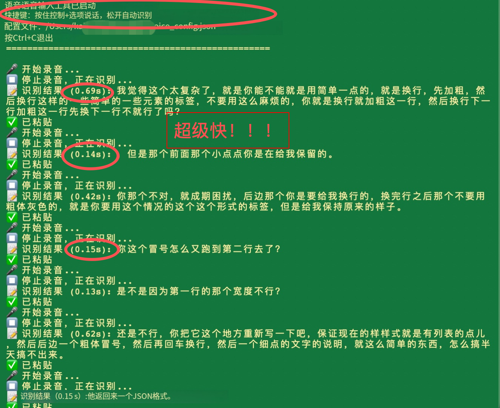

# 秒输 (Miaoshu)

> "人生不在输，而在秒输。"

一个完全离线的语音输入工具，基于阿里 SenseVoice 模型，专为 macOS 设计。



## 特点

🚀 **秒级响应** — 说完松手就出结果，几乎零延迟  
🔒 **纯本地运行** — 不联网也能用，隐私完全保护  
🎯 **中文超准** — 阿里专门优化，中文识别效果拔群  
🆓 **完全免费** — 开源项目，代码随便看  

## 为什么叫"秒输"？

说实话，起这个名字的时候我也纠结过。

朋友说："叫秒输？听起来像秒速失败啊！"

我说："正因为叫秒输，所以反而不会输。这叫负负得正。"

所以，人生不在输，而在**秒输**—— 说得快，输得快，赢得也快。

## 安装

### 1. 安装依赖

```bash
pip3 install sherpa-onnx sounddevice pynput pyobjc-core pyobjc-framework-Cocoa pyobjc-framework-Quartz
```

### 2. 下载模型

```bash
wget https://github.com/k2-fsa/sherpa-onnx/releases/download/asr-models/sherpa-onnx-sense-voice-zh-en-ja-ko-yue-2024-07-17.tar.bz2
tar -xjf sherpa-onnx-sense-voice-zh-en-ja-ko-yue-2024-07-17.tar.bz2
mkdir -p ~/Models/ASR
mv sherpa-onnx-sense-voice-zh-en-ja-ko-yue-2024-07-17 ~/Models/ASR/
```

### 3. 下载代码

```bash
git clone https://github.com/saddism/miaoshu.git
cd miaoshu
```

### 4. 授权权限

打开 **系统设置 → 隐私与安全性**：
- **麦克风** → 允许终端
- **辅助功能** → 允许终端

### 5. 运行

```bash
python3 voice_input.py
```

## 使用

按住 `Ctrl + Option`，说话，松手。文字自动输入到光标位置。

支持应用：微信、飞书、VSCode、浏览器...任何能输入文字的地方。

## 配置

创建 `~/.miaoshu_config.json`：

```json
{
  "hotkey": "ctrl_alt",
  "language": "auto",
  "use_itn": true,
  "auto_punctuation": true
}
```

## 效果对比

| 方案 | 中文识别 | 速度 | 价格 | 离线 |
|------|---------|------|------|------|
| **秒输** | ⭐⭐⭐⭐⭐ | 秒出 | 免费 | ✅ |
| Whisper | ⭐⭐⭐ | 慢 | 免费 | ✅ |
| Typeless | ⭐⭐⭐ | 中等 | $200 | ❌ |
| 讯飞 | ⭐⭐⭐⭐ | 快 | 免费 | ❌ |

## License

MIT
